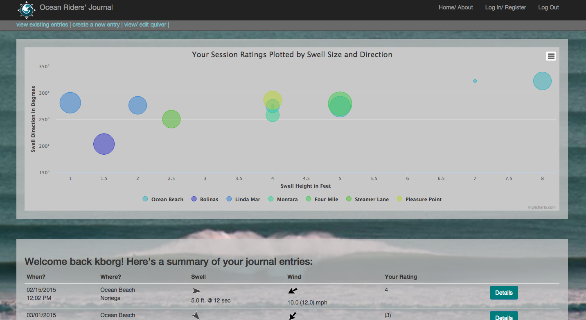
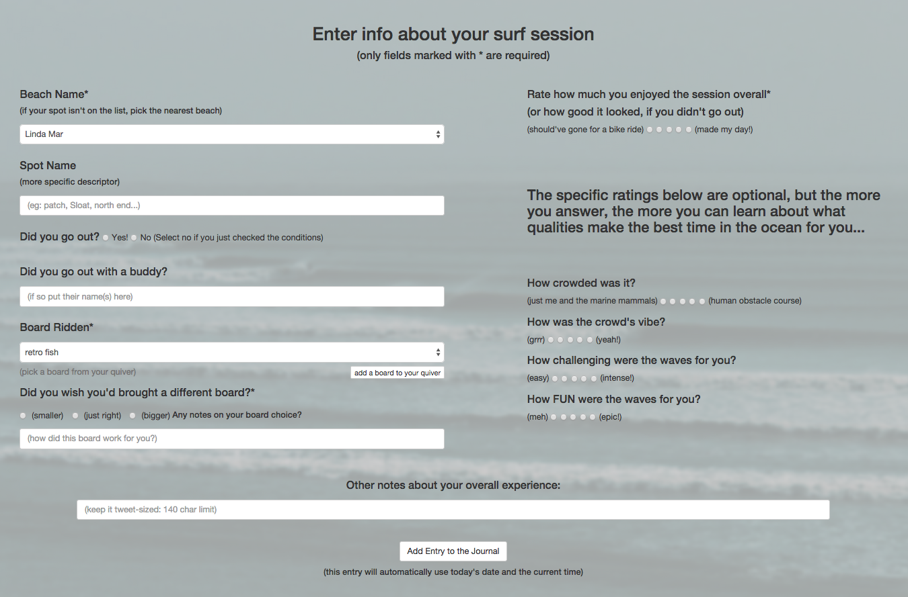
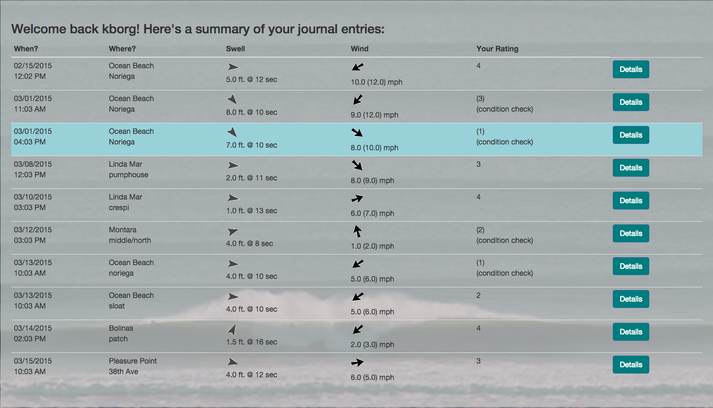
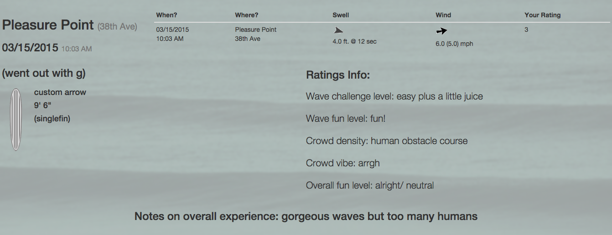
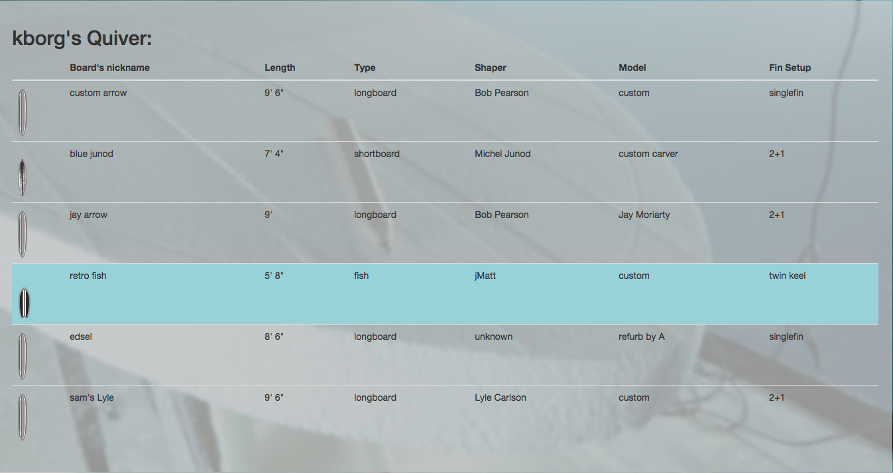
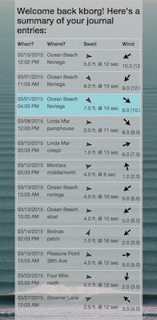
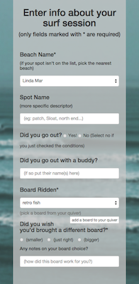
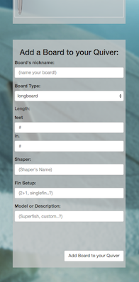

Ocean Riders' Journal
===========
**This app is no longer in development, and is not functional in its current state:**  
**the magicseaweed api previously used here has been retired by its creators.**

Ocean Rider’s Journal is a place for Northern and Central California surfers to 
record their time in the ocean. The journal collects swell and wind data based 
on time and location, and combines it with subjective user ratings to visually 
graph the best conditions for the user, with the aim to help users develop a 
keener sense of what conditions work best for them at their favorite spots.

### Technology

Ocean Rider’s Journal uses a Python controller and a Flask web framework. The 
SQLite database collects information provided by users about their surf 
sessions, the boards they ride, and the wind and swell conditions at the time 
of each journal entry. Weather data is gathered from the (now defunct) magicseaweed API.

Python, Flask, Jinja2, SQLite, SQLAlchemy, HTML5, CSS, highcharts.js, and 
Bootstrap. (Dependencies are listed in requirements.txt)

##### Screengrabs

Each user can add an entry to their personal surf journal:

View a summary of all journal entries:

Summary page includes a chart correlating overall ratings with swell conditions:

Journal entry details page displays the more subjective/ contextual user input: 

The "Quiver" page is where the user creates, views, and edits their collection of surfboards.

##### Designed for Mobile Responsiveness

 

##### To recreate this webapp locally

- Sign up for an API key at: http://magicseaweed.com/developer/sign-up.
- Store your API keys as "MSW_ACCESS_TOKEN" and "MSW_ACCESS_TOKEN_SECRET" in a 
local "secrets.sh" file (be sure to add this file to your gitignore before 
committing).
- Create a hash and export it as "APP_SECRET_KEY" in your "secrets.sh" file.
- Create a virtual env and install the required packages.
- Source the virtual env and then source your secrets file.
- Run the model.py file in interactive mode (`python -i models/base.py`) and 
follow the prompts to initialize your database.
- Run the db_seed.py in python (python db_seed.py) to seed the database 
(this step is necessary to see beach locations in the "add entry" form).
- Start the webapp (python surfjournal.py), register as a user, and start 
exploring the journal!

##### Acknowledgements
Thanks to [Junior Bill](http://www.juniorbill.com) for lending me his classic 
surboard artwork for the quiver icons. 

##### Contact Me

Connect with the developer: www.linkedin.com/in/kborges
